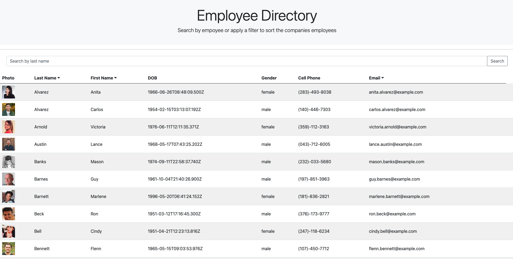
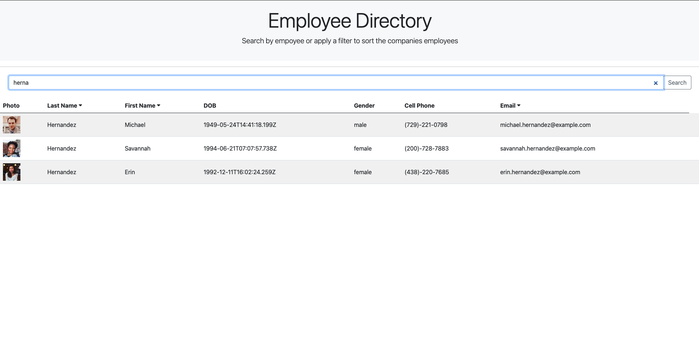

# Employee Directory


[](https://opensource.org/licenses/MIT)


## [Test Out The Employee Tracker Here!](https://alexva397.github.io/employee-directory/)


## Description

This React App is an employee directory tha allows the user to search and sort for easy navigation.

This repo utilizes a random user API to simulate a list employees at a business.

You can test my employee tracker at the link above, or follow the instructions in installation/usage to run on your local machine. 


## Table of Contents

- [Installation](#installation)
- [Usage](#usage)
- [Technoloy](#technology)
- [Contributing](#contributing)
- [License](#license)
- [Tests](#test)
- [Questions](#questions)








## Installation

 First, to run on your local machine, please clone the repo and navigate inside of it

 Then, the user must install all the dependencies listed within the package.json. To do so, run:

 ```
 npm i
 ```

 from within the main directory of the app.

 The employee directory is now ready for use.


## Usage

Run the following on the command line to launch the app:

```
npm start
```

From here, the app will launch in your default web browser.  

Or, navigate to [http://localhost:3001](http://localhost:3001/) in your browser to use the app.


## Technology

This App utilizes the following technologies:

  - ReactJs
  - Node.js
  - Bootstrap

## Contributing

If you would like to contribute to the repository, please contact me at one of the links at the bottom of the README.


## License

[](https://opensource.org/licenses/MIT)


## Tests

  There are not any tests written for this repository.


## Questions

  If you have any questions regarding the repo, please contact me at one of the following:
    
  [Github](https://github.com/Alexva397)

  [LinkedIn](https://www.linkedin.com/in/alexander-vadeboncoeur-287039aa/)

  [asvadeboncoeur@gmail.com](mailto:asvadeboncoeur@gmail.com)


